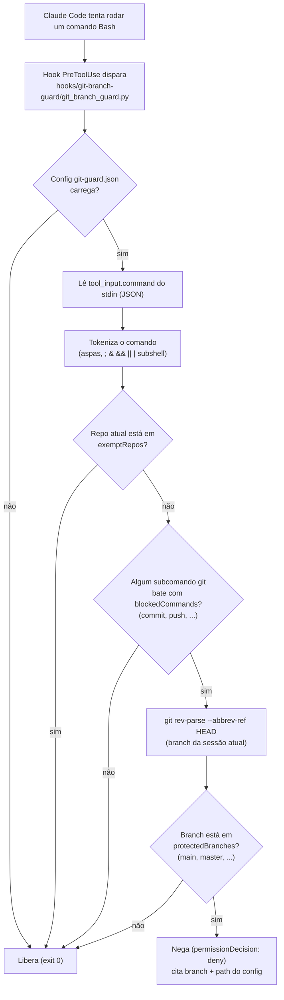

# TOOLS

Harness do time IA AUTOMATION: Claude Code como motor, plugado nos repositórios do dia a dia.

Documentação completa das regras e estrutura: [claude.md](claude.md).

## Como iniciar

1. Abra o Claude Code a partir desta pasta (`TOOLS/`). Outros repositórios entram via `--add-dir` / `additionalDirectories`.

   ```bash
   cd /caminho/para/TOOLS
   claude
   ```

2. Os hooks já vêm registrados em `.claude/settings.json` e carregam automaticamente na sessão. Se você editou `.claude/settings.json` ou o código de um hook no meio de uma sessão já aberta, rode `/hooks` uma vez (ou reinicie a sessão) para recarregar.

## Rodando os hooks (Python)

Os hooks são scripts Python (stdlib only, sem dependências) executados direto por path — sem build step. Só precisa de `python3` no PATH (testado com 3.12) e do script com bit de execução (já vem assim; `chmod +x hooks/<nome>/*.py` se precisar reconceder depois de um clone).

Para conferir se o guardrail está ativo, tente um `git commit` estando na branch `main`/`master`: o comando deve ser negado pelo hook.

## Como funciona (guardrail de git)



Pontos-chave:

- O script roda uma vez por comando `Bash` que o Claude Code tenta executar — antes de qualquer coisa ser de fato executada.
- A branch checada é a do repositório onde a **sessão** está (cwd do hook), não a de um repositório de destino dentro do comando (ex.: `cd outro-repo && git commit` ainda é avaliado contra a branch do repo da sessão).
- Qualquer resultado que não seja "nega" deixa o comando seguir normalmente para o Claude Code executar.

## Serena (MCP de navegação de código)

Ferramentas de navegação/edição semântica de código (via LSP) e memória persistente por projeto, pra usar nos repositórios de trabalho reais (plugados via `--add-dir`) — não no `TOOLS/` em si.

- Repositório do Serena: https://github.com/oraios/serena
- Docker (instalação): https://docs.docker.com/get-docker/

```bash
cd settings/serena
cp .env.example .env    # ajuste SERENA_PROJECTS_DIR pro diretório pai dos seus repos
docker compose up -d
```

O registro no Claude Code já vem pronto via `.mcp.json` (raiz do repo, versionado) — não precisa rodar `claude mcp add`. Na primeira vez que abrir o harness (com o container já rodando), o Claude Code pede aprovação de confiança do servidor; aceite o prompt e as ferramentas `mcp__serena__*` ficam disponíveis. Dashboard web em `http://localhost:24282/dashboard/index.html`.

### Cobertura de linguagem

Das stacks que usamos nos repos reais (Go, TypeScript, Java, Python), a imagem oficial cobre TypeScript e Java sozinha — o language server de cada um é baixado automaticamente na primeira vez que um projeto daquela linguagem é ativado (TS via npm, Java via bundle do `redhat-developer/vscode-java` com JRE embutido) — e Python já funciona de cara (a imagem já tem `uv`/`uvx`). **Go não funciona**: o `gopls` exigiria o toolchain Go pré-instalado, que a imagem oficial não tem. Já avaliamos estender a imagem com um Dockerfile próprio pra isso (funcionou, testado), mas decidimos não manter — o custo de passar a ser dono da manutenção dessa imagem (perder updates automáticos do Serena) não compensou pra fechar essa lacuna. Navegação semântica em projeto Go fica sem suporte por enquanto.

Se `docker compose up` der `permission denied` no socket do Docker (comum com o snap do Docker no Ubuntu, que não cria o grupo `docker` sozinho):

```bash
sudo addgroup --system docker
sudo adduser $USER docker
sudo snap disable docker && sudo snap enable docker
# depois: logout/login, ou `newgrp docker` / `sg docker -c "..."` pra testar sem relogar
```
